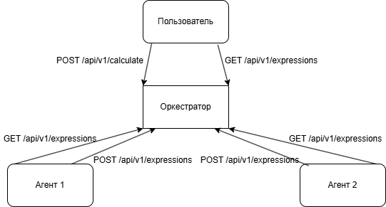

# Сервис подсчета арифметических выражений 
Выполнен в рамках курса «Программирование на Go | 24» 

# Описание 
Веб-сервис, который принимает от пользователя POST-запрос с арифметическим выражением, организовывает вычленение задач, необходимых для его вычисления и вычисляет это выражение с использованием параллельных вычислений (вычисления проводятся в "агенте", получающем задачи и сообщающем об их результатах с помощью http)

# Запуск
(Требования: go, git)</br>
Выполните команды:</br>
```
git clone git@github.com:Starostina-elena/yalms_go_task3.git
```
```
cd yalms_go_task3
```
```
go mod init github.com/Starostina-elena/yalms_go_task3
```
Для запуска оркестратора (основной части приложения) выполните команду</br>
```
go run .\cmd\orchestrator\main.go
```
Для запуска агента в отдельном окне консоли выполните команду</br>
```
go run go run .\cmd\agent\main.go
```

# Примеры использования 
### Добавление выражения

Корректный запрос
```
curl --location "http://localhost:8080/api/v1/calculate" --header "Content-Type: application/json" --data "{\"expression\": \"2+2\"}"
```
Ответ (статус 201)
```
{
    "id": 1
}
```
Некорректный запрос
```
curl --location "http://localhost:8080/api/v1/calculate" --header "Content-Type: application/json" --data "{\"expression\": \"2+f\"}"
```
Ответ (статус 422)
```
недопустимый символ в выражении
```
### Получение всех выражений
```
curl --location "localhost:8080/api/v1/expressions"
```
Ответ (статус 200)
```
{
    "expressions": [
        {
            "id": 1,
            "expression": "2*6+3*6",
            "status": "pending"
        },
        {
            "id": 2,
            "expression": "2*6",
            "status": "done",
            "result": 12
        }
    ]
}
```
### Получение выражения по id
Корректный запрос
```
curl --location "localhost:8080/api/v1/expressions/1"
```
Ответ (статус 200)
```
{"expression":{"id":1,"expression":"2*6+3*6","status":"pending"}}
```
Id не существует
```
curl --location "localhost:8080/api/v1/expressions/100"
```
Ответ (статус 404)
```
Id not found
```
Id некорректен
```
curl --location "localhost:8080/api/v1/expressions/abc"
```
Ответ (статус 400)
```
Invalid ID
```
### Получение задачи агентом
```
curl --location "localhost:8080/internal/task"
```
Ответ (статус 200)
```
{
    "task": {
        "id": 14,
        "arg1": 3,
        "arg2": 6,
        "operation": "*",
        "operation_time": 5000
    }
}
```
Ответ (статус 404)
```
No tasks available
```
### Отправка результата вычисления задачи
```
curl --location "localhost:8080/internal/task" --header "Content-Type: application/json" --data "{\"id\": 1, \"result\": 2.5}"
```
Ответ (статус 200) - пустой </br>
Ответ (статус 404)
```
task not found
```
Некорректные данные:
```
curl --location "localhost:8080/internal/task" --header "Content-Type: application/json" --data "{\"id\": 9, \"result\": 4"
```
Ответ (статус 422)
```
invalid data
```
# Запуск тестов

Выполните команды:</br>
```
cd tests
```
```
go test
```
# Структура проекта


<p>Система состоит из оркестратора и агента.</p>
<p>Оркестратор принимает от пользоваля POST запросы с выражениями, разбивает полученное выражение на части и создает задачи для вычисления выражения. Пользователь может прислать GET запрос для получения информации о выражениях.</p>
<p>Агент периодически посылает GET запросы оркестратору. Если у оркестратора есть еще не назначенные ни одному из агентов задачи, он вернет агенту задачу. Агент отправляет результат задачи с помощью POST запроса</p> 
<p>Система настраивается с помощью переменных среды
<ul>
<li>PORT - порт, на котором работает оркестратор. По умолчанию 8080</li>
<li>TIME_ADDITION_MS - время выполнения операции сложения. По умолчанию 5000</li>
<li>TIME_SUBTRACTION_MS - время выполнения операции вычитания. По умолчанию 5000</li>
<li>TIME_MULTIPLICATIONS_MS - время выполнения операции умножения. По умолчанию 5000</li>
<li>TIME_DIVISIONS_MS - время выполнения операции деления. По умолчанию 5000</li>
<li>COMPUTING_POWER - количество агентов. По умолчанию 2</li>
<li>ORCHESTRATOR_URL - ссылка, по которой агент ищет оркестратор. По умолчанию http://localhost:8080</li>
</ul>
</p>